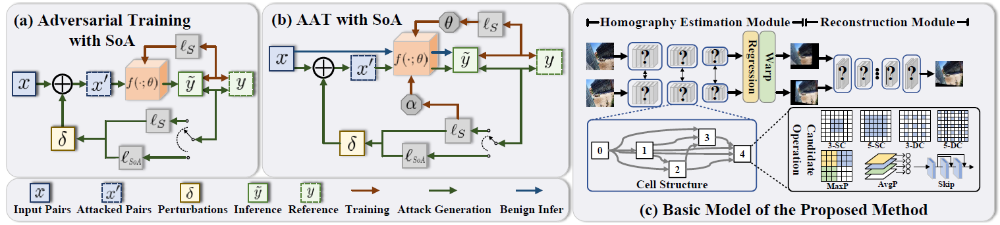

# Towards Robust Image Stitching: An Adaptive Resistance Learning against Compatible Attacks
This repo is the official implementation of,
**“[Towards Robust Image Stitching: An Adaptive Resistance Learning against Compatible Attacks]”**, 
Zhiying Jiang, Xingyuan Li, Jinyuan Liu, Xin Fan, Risheng Liu*, Association for the Advancement of Artificial Intelligence __(AAAI)__, 2024.

## Overview


## Prerequisites
- Linux or macOS
- Python 3
- CPU or NVIDIA GPU + CUDA CuDNN

## 🔑 Installation
Type the command:
```
pip install -r requirements.txt
```

## 🤖 Download
Download the pre-trained model
- [Google Drive](https://drive.google.com/drive/folders/1HvAHd3QGUmXwrY7P-oW65RNka-Av4h8K?usp=sharing)

## ImageAlignment
- First, you need to train a imagealignment model:
```bash
cd ImageAlignment
python train.py
```
- Evaluation
To test a trained network(you can train by yourself or use the pre-trained model):

```Shell
python test.py
```

## ImageReconstruction
- Second, you need to train a imagereconstruction model:
```bash
cd ../ImageReconstruction
python train.py
```
- Evaluation
To test a trained network(you can train by yourself or use the pre-trained model):

```Shell
python test.py
```
Then you can get the final robust stitching results.
