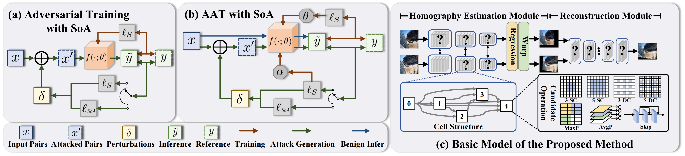

# Towards Robust Image Stitching: An Adaptive Resistance Learning against Compatible Attacks
This repo is the official implementation of,
**“Towards Robust Image Stitching: An Adaptive Resistance Learning against Compatible Attacks”**, 
Zhiying Jiang, Xingyuan Li, Jinyuan Liu, Xin Fan, Risheng Liu*, Association for the Advancement of Artificial Intelligence __(AAAI)__, 2024.

- [*[ArXiv]*](https://arxiv.org/abs/2402.15959)

## Overview
<p align="center">
  
</p>


## Prerequisites
- Linux or macOS
- Python 3
- CPU or NVIDIA GPU + CUDA CuDNN

## 🔑 Installation
Type the command:
```
pip install -r requirements.txt
```

## 🤖 Download
Download the pre-trained model
- [Google Drive](https://drive.google.com/drive/folders/1HvAHd3QGUmXwrY7P-oW65RNka-Av4h8K?usp=sharing)
- [Baidu Yun](https://pan.baidu.com/s/1x3l1eGO27ScgUksgG9l9zg) \
code:
​```
0817
​```

## Note
  * For training, an NVIDIA GPU is strongly recommended for speed.
  * You can train and test the model using the following commands, or choose the pre-trained checkpoint that we provide.
  * For using custom data and pre-trained models, you need to replace the paths in the code with your own local paths.

## ImageAlignment
- First, you need to train a image alignment model:
```bash
cd ImageAlignment
python train.py
```
- To test a trained alignment network:

```Shell
python test.py
```

## ImageReconstruction
- Second, you need to train a image reconstruction model:
```bash
cd ../ImageReconstruction
python train.py
```
- To test a trained reconstruction network:

```Shell
python test.py
```
Then you can get the final robust stitching results.
